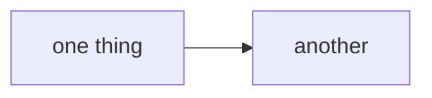

# Website

This website is built using [Docusaurus](https://docusaurus.io/), a modern static website generator.

## Installation

```bash
npm install
```

**Note**: feel free to use the package manager of your choice.

## Local Development

```bash
npm run start
```

This command starts a local development server and opens up a browser window. Most changes are reflected live without having to restart the server.

## Build

```bash
npm run build
```

This command generates static content into the `build` directory and can be served using any static contents hosting service.

## Deployment

Using SSH:

```bash
USE_SSH=true npm run deploy
```

Not using SSH:

```bash
GIT_USER=<Your GitHub username> npm run deploy
```

If you are using GitHub Pages for hosting, this command is a convenient way to build the website and push to the `gh-pages` branch.

## Diagrams

**Mermaid on the website; ASCII in a code fence everywhere else.** The
constraint that produced this repo's ASCII diagrams is a terminal — `CLAUDE.md`
and `docs/*.md` are read in one, and mermaid there is source nobody can see.
The website has no terminal, so a diagram can render, follow the reader's light
or dark theme, and reflow on a phone.

````md

````

One thing to know before adding one: **the build is not a gate for diagrams.**
`onBrokenLinks: 'throw'` makes `npm run build` a real check for links, but a
mermaid syntax error compiles fine and ships — `@docusaurus/theme-mermaid`
renders client-side, so the failure surfaces as an error box in the reader's
browser behind a green build and a green deploy. Check a new diagram by
rendering it, not by building the site.
