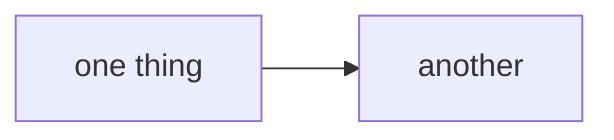

# Website

This website is built using [Docusaurus](https://docusaurus.io/), a modern static website generator.

## Installation

```bash
npm ci
```

Use Node.js 20 or newer; CI uses Node.js 22. `npm ci` installs the locked
dependency versions.

## Local Development

```bash
npm run start
```

This command starts a local development server and opens up a browser window. Most changes are reflected live without having to restart the server.

## Build

```bash
npm run build
```

This command generates static content into the `build` directory and can be served using any static contents hosting service.

## Updating the docs

Authored pages live in `docs/`, with `title`, `sidebar_position`, and
`description` front matter. The sidebar is generated from the directory tree.
Update the overview and getting-started links when a feature changes the daily
workflow, as well as the feature page and CLI/configuration references.

Verify commands against a freshly built `mecha <command> --help`, and config
keys and defaults against `mecha-core/src/config.rs`, including `ConfigLayer`.
The site tracks main; changes newer than the current release should be
understandable alongside the root changelog's Unreleased section.

Do not edit generated sources here:

- `docs/changelog.md` is copied from the root `CHANGELOG.md`.
- Generated graph pages come from the graph repository; `docs/graph/overview.md`
  is authored here.
- `static/factory/gallery/` comes from the factory repository.
- `static/demo/` is built from this repository's `web/` app and demo fixtures.

The prebuild scripts refresh these automatically, using sibling checkouts for
graph and gallery content when available and public sources otherwise. A missing
source can leave those pages or embeds unavailable, so read the build output.

```bash
npm run typecheck
npm run check-charter-toml
npm run check-demo
npm run build
MECHA_DOCS_REQUIRE_BROWSER=1 npm run render-check
```

The final check requires Playwright Chromium (`npx playwright install chromium`).
For a prose change, also open the affected built pages and check their links.

## Deployment

**Push to `main`. That is the whole procedure.**
`.github/workflows/docs.yml` builds the site and publishes it with
`actions/deploy-pages@v5`, so the deploy is an artifact upload rather than a
branch — there is no `gh-pages` branch in this repository and nothing serves
one. The workflow runs on pull requests too, and `onBrokenLinks: 'throw'` means
a dead internal link fails it.

**Do not run `npm run deploy`.** It is Docusaurus's stock script, it survives
here only because it ships in the template, and what it does is build the site
and force-push it to a `gh-pages` branch. Following the instructions this
section used to carry would create a branch nothing reads, while the live site
carried on being served from the workflow — a deploy that appears to succeed
and changes nothing anybody can see.

Local checks before pushing:

```bash
npm run build    # what CI runs; fails on a broken internal link
npm run serve    # serve the built site to look at it
```

## Diagrams

**Mermaid on the website; ASCII in a code fence everywhere else.** The
constraint that produced this repo's ASCII diagrams is a terminal — `CLAUDE.md`
and `docs/*.md` are read in one, and mermaid there is source nobody can see.
The website has no terminal, so a diagram can render, follow the reader's light
or dark theme, and reflow on a phone.

````md

````

One thing to know before adding one: **the build is not a gate for diagrams.**
`onBrokenLinks: 'throw'` makes `npm run build` a real check for links, but a
mermaid syntax error compiles fine and ships — `@docusaurus/theme-mermaid`
renders client-side, so the failure surfaces as an error box in the reader's
browser behind a green build and a green deploy. Check a new diagram by
rendering it, not by building the site.

## The embedded web demo

The docs embed a **live, clickable copy of the `mecha serve` web app** — on the
homepage, on `features/web`, and on `features/interfaces`. It is the real
bundle from `web/`, built by the same Vite config, with fixtures answering
`/api` instead of a box.

It cannot be a screenshot. `mecha serve` binds loopback and refuses any request
without the owner's tailnet identity, so there is no public instance to link,
and a screenshot of a real one would be a picture of somebody's actual mail on
a public repository. So `web/src/demo/fixtures.js` invents a cast, and
`web/src/demo/index.js` replaces `fetch` and `EventSource` with a table of
routes over it.

```bash
npm run build-demo     # builds web/ in demo mode into static/demo/ (a prebuild step)
npm run check-demo     # fails if the app reaches an endpoint the demo cannot answer
npm run render-check   # loads every page in chromium and fails if one breaks
```

`static/demo/` is gitignored, like `static/factory/gallery/`: `web/` is in this
repository, so there is a source tree and a build of it rather than two sources
of truth.

Five things to know when changing either side:

- **Adding a page or an endpoint to `web/` means adding a fixture.** Otherwise
  the demo answers `501`, the component renders its own error state, and a docs
  reader sees what looks like a broken feature. `check-demo` fails the build on
  exactly that, and runs in CI before the docs build.
- **Fixture *shapes* are not invented.** Each was read off the handler in
  `mecha-cli/src/commands/serve/` and the component that renders it. Getting one
  wrong does not throw — it draws an empty pane — so the way to verify a fixture
  is to load the page and look at it.
- **`render-check` is the step that does that looking**, and it is the only one
  here that executes the app. `check-demo` reads fixtures and route tables;
  `docusaurus build` renders no client JavaScript. A page can be broken with
  both green, and v0.1.16 shipped exactly that — a `stalled` ReferenceError
  that emptied the task board, invisible to the Rust suite because the defect
  was entirely in the Svelte. It fails on three things: an uncaught or console
  error, a page that drew almost nothing (a component that throws still leaves
  the shell and nav behind, which looks like a page), and any of the app's own
  "could not read that" affordances. It also drives one scripted chat turn,
  because the docs claim a reader can watch a run happen and a static load does
  not check that claim. Its route list is parsed out of `App.svelte`, so a new
  page is covered without anyone remembering to add it.
- **A missing browser skips locally and fails in CI.** `MECHA_DOCS_REQUIRE_BROWSER=1`
  turns the skip into a failure and the workflow sets it — same rule as
  `MECHA_TEST_REQUIRE_BACKENDS=1` in the Rust integration tests, because a
  silently skipped check in CI reads exactly like a passing one.
- **The demo must not reach the shipped bundle.** It is behind
  `import.meta.env.VITE_MECHA_DEMO`, so Rollup drops it from `npm run build`.
  `check-demo` greps `web/dist` for a fixture string when one has been built.
