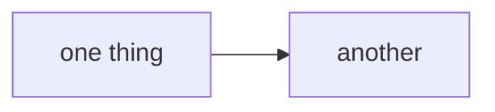

# Website

This website is built using [Docusaurus](https://docusaurus.io/), a modern static website generator.

## Installation

```bash
npm install
```

**Note**: feel free to use the package manager of your choice.

## Local Development

```bash
npm run start
```

This command starts a local development server and opens up a browser window. Most changes are reflected live without having to restart the server.

## Build

```bash
npm run build
```

This command generates static content into the `build` directory and can be served using any static contents hosting service.

## Deployment

**Push to `main`. That is the whole procedure.**
`.github/workflows/docs.yml` builds the site and publishes it with
`actions/deploy-pages@v5`, so the deploy is an artifact upload rather than a
branch — there is no `gh-pages` branch in this repository and nothing serves
one. The workflow runs on pull requests too, and `onBrokenLinks: 'throw'` means
a dead internal link fails it.

**Do not run `npm run deploy`.** It is Docusaurus's stock script, it survives
here only because it ships in the template, and what it does is build the site
and force-push it to a `gh-pages` branch. Following the instructions this
section used to carry would create a branch nothing reads, while the live site
carried on being served from the workflow — a deploy that appears to succeed
and changes nothing anybody can see.

Local checks before pushing:

```bash
npm run build    # what CI runs; fails on a broken internal link
npm run serve    # serve the built site to look at it
```

## Diagrams

**Mermaid on the website; ASCII in a code fence everywhere else.** The
constraint that produced this repo's ASCII diagrams is a terminal — `CLAUDE.md`
and `docs/*.md` are read in one, and mermaid there is source nobody can see.
The website has no terminal, so a diagram can render, follow the reader's light
or dark theme, and reflow on a phone.

````md

````

One thing to know before adding one: **the build is not a gate for diagrams.**
`onBrokenLinks: 'throw'` makes `npm run build` a real check for links, but a
mermaid syntax error compiles fine and ships — `@docusaurus/theme-mermaid`
renders client-side, so the failure surfaces as an error box in the reader's
browser behind a green build and a green deploy. Check a new diagram by
rendering it, not by building the site.
