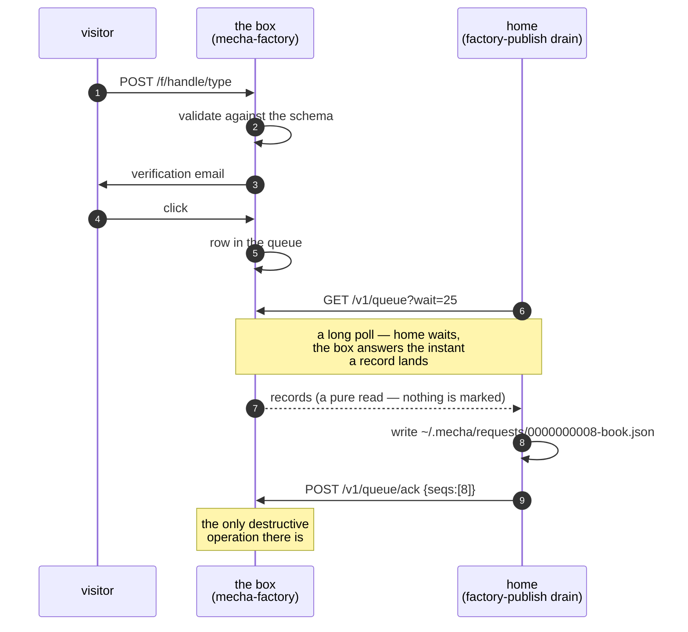
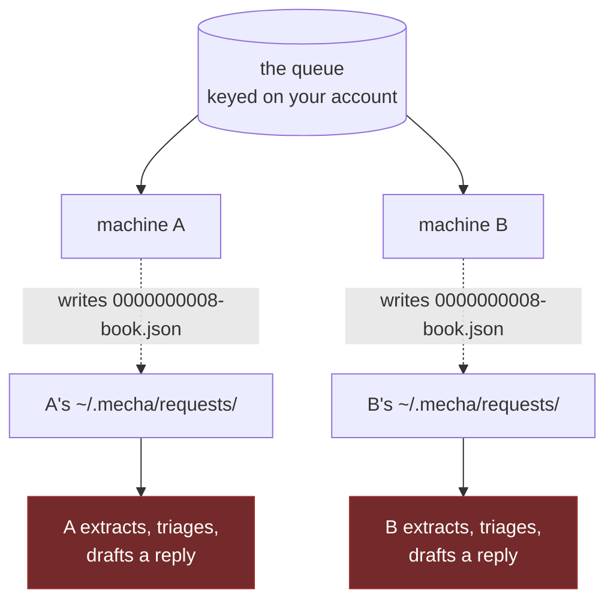

# The inbound queue

Everything inbound passes through one queue on the box, and almost every
question people ask about it — *is something listening? what if my agent is
down? do I have to reconnect?* — has the same answer, which is that **there is
no connection to lose.**

The box never dials home. Home dials out.

The shape to carry: **home pulls, writes, and only then permits a delete.**

## Nothing is connected, in the literal sense

There is no session, no registration, no socket held open in the other
direction, and nothing on the box that knows whether you exist right now.
Authorisation is a bearer key in a file — `~/.mecha/factory/drain.key`, mode
`0600`, minted once when you paired the machine.

So:

- **Killing an agent breaks nothing.** There is no subscription to lapse.
- **Restarting does not require reconnecting.** The drain loop starts, reads
  its key off disk, and long-polls again.
- **"Instant" is a property of who waits, not of who calls.** `--wait 25` holds
  a request open on the box, so a booking becomes a calendar event seconds
  after the click — with the connection still initiated from home every time.

## What happens when no machine of yours is running

The queue grows. That is the whole answer, and two design choices guarantee it:

**`GET /v1/queue` is a pure read.** Records are not marked, leased, or consumed
by being fetched. A response that never arrives costs nothing but a repeat —
and repeating is correct, because the alternative is a stranger's request
disappearing into a dropped connection.

**Deleting is a separate, explicit act.** `POST /v1/queue/ack` names every
sequence number it removes. It is deliberately *not* a watermark: a watermark
deletes rows nobody named, and that failure is silent.

Home writes the bytes to disk *before* acknowledging. A crash between the two
means the record arrives again on the next drain; a crash the other way round
would lose a real person's request with no trace on either machine. Only one of
those is recoverable, so the ordering is not negotiable.

:::note[At-least-once, and where the duplicate is absorbed]
Because a fetch is not a consume, delivery is at-least-once and de-duplication
happens at home. It happens *by filename*: a record lands as
`0000000008-book.json`, keyed on the box's sequence number, so a re-delivered
record overwrites itself instead of becoming a second row. Note the boundary of
that guarantee — a filesystem. It works perfectly within one machine and not at
all across two.
:::

Two smaller properties worth knowing:

- **`since` stays 0.** The endpoint takes a cursor and home deliberately does
  not use one, because a cursor would let home's idea of what it holds drift
  ahead of what it actually wrote. Asking for everything and writing what is
  new is self-healing.
- **A record that fails validation at home is still written**, with
  `valid: false` and a reason. The box validated it on the way in and home
  validates again — neither trusts the other — but a mismatch is a bug in *us*,
  and losing somebody's request over it is the one outcome worth avoiding.

## The one way data leaves without being drained

A request type may declare `retain_days` in its manifest. That stamps a
`retain_until` on the row, and a sweep on the box (`factory sweep`, on a timer)
removes what has passed it, files included. A type that declares nothing keeps
its records until they are drained and acked.

So an unattended queue is bounded by your own retention policy and by nothing
else. If you want a request type to survive a long absence, leave `retain_days`
unset.

## More than one drainer

This is the one place the design has a sharp edge, and it follows directly from
"a fetch is not a consume".

**The queue belongs to an account, not to a machine.** Every machine you pair
holds its own `drain.key`, but they all drain the same rows.

Since there is no lease, two machines polling at once both receive the record,
both write it, and both run it through [the front
door](/docs/features/frontdoor) — producing two drafted replies in two outboxes,
neither aware of the other. The `ack` race itself is harmless (whoever acks
first deletes; the second ack deletes nothing). The duplicated *work* is not.

**Run exactly one draining machine per account.** If a second machine needs to
publish, pair it and let it hold `publish.key` without `drain.key` — the scopes
are separate for exactly this reason.

### Several drainers on one machine are fine, and normal

Within a single machine the seq-keyed filename absorbs everything, which is why
the shipped arrangement has three drainers running happily side by side:

| What | Cadence | Why |
|---|---|---|
| `mecha-drain.service` | continuous long poll | Latency. A confirmed booking reaches the calendar in seconds. |
| `mecha-slots.timer` | every few minutes | Backstop. A wedged loop degrades to this instead of to silence. |
| `frontdoor.sh` | hourly | Drains before extraction, so the token-free leg runs even when the model server is down. |

That last row is the ordering rule generalised: **drain is the zero-token leg**,
so it runs first and unconditionally. A dead model server must never stop
requests from coming home.

## What the box will not tell you

The box tracks queue depth per account, but today it surfaces that only to an
operator, and it records nothing at all about *when a machine last drained*.
There is consequently no "your agent is connected" indicator anywhere in the
account UI.

Worth knowing because of what it means for silence: a queue with three
untouched requests looks identical to a queue nobody has written to. If you
want certainty that the path is working end to end, the honest check today is
at home — look for records arriving in `~/.mecha/requests/`, or run
[`mecha doctor`](/docs/features/run-quality), which reports requests that have
been waiting on you past a threshold.

## Next

- [The front door](/docs/features/frontdoor) — what happens to a drained
  request: the quarantined extraction, triage, and the draft you review.
- [Onboarding](/docs/factory/onboarding) — pairing a machine, and which keys
  land on it.
- [What the factory is](/docs/factory/overview) — the boundary in both
  directions.
