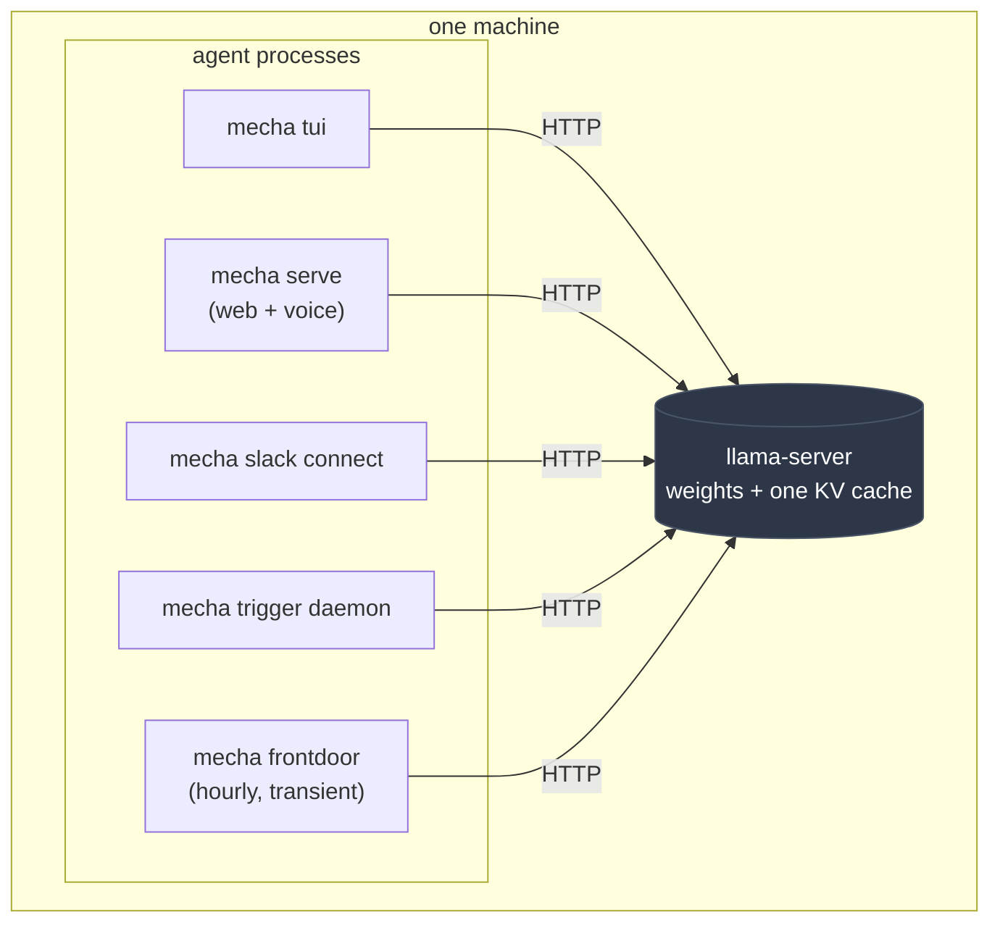

import WebFrame from '@site/src/components/WebFrame';

# Interfaces

One agent loop, five ways to drive it. Four are in a terminal and one is a
browser, and the browser is not the lesser of them: it is the only surface
that runs on a phone, the only one that takes a microphone, and the one most
of the reviewing actually happens on.

| | What it is | Where | Steer a run? |
|---|---|---|---|
| [`mecha run`](#mecha-run--one-task-one-answer) | one task, one answer, then exit | terminal | no |
| [`mecha chat`](#mecha-chat--a-repl) | a readline REPL | terminal | no |
| [`mecha tui`](#mecha-tui--full-screen-and-steerable) | full-screen; the input line stays live | terminal | **yes** |
| [`mecha serve`](#mecha-serve--the-web-surface) | the web app on your tailnet — **and the only door voice opens through** | browser, phone | **yes** |
| [`mecha batch`](#mecha-batch--fan-out) | fan-out over a file of prompts | terminal | n/a |

The loop itself is the same code in all five. What differs is **who owns the
input**, and that single fact decides what each front end can do — most
visibly, whether you can redirect a run without stopping it. A readline REPL
owns stdin only between runs and so cannot steer; the TUI and the web app each
have one event loop holding the input for the whole session, and both can. See
[cancel and steer are different things](#cancel-and-steer-are-different-things).

[Slack](/docs/features/slack) is deliberately not a sixth entry. It is a
*remote control*: `mecha slack connect` answers in its own threads, and
`/remote-control` puts an existing terminal session into a named thread so the
two are one conversation. Which one you get is decided by the same question
about ownership — see [the remote control is that owner, from somewhere
else](#the-remote-control-is-that-owner-from-somewhere-else).

[Voice](/docs/features/voice) is not a sixth entry either, for a more concrete
reason: **it is not a separate front end at all.** A call is opened from the
chat view of the web surface and speaks into the conversation already open
there. There is no `mecha voice` you can run in a terminal, no phone number,
and no other way in. If you want to talk to mecha, `mecha serve` is the door.

## One loop, several processes, and no extra models

A question that comes up the first time a second agent starts: *if I run the
TUI, a Slack connector and a trigger daemon, am I running three copies of the
model?*

No. **"Agent" and "model" are different processes, and only one of them holds
weights.**



Every box on the left is an ordinary process holding no model at all. A
`Provider` is an HTTP client — see [Providers](/docs/features/providers) for
the trait — so starting another agent starts another client, never another
copy of the weights.

## What an agent actually costs

Two resources, and they are wildly different sizes:

| | Cost |
|---|---|
| Model memory | **Zero.** The weights and the KV cache belong to the server process. |
| Host RAM | Tens of megabytes. The harness is a thin client; a long-running agent typically sits in the 10–25 MB range resident. |
| MCP servers | One set **per agent process**, spawned once with the agent. Each is its own subprocess, typically another 10 MB apiece. |

That last row is the only one that scales in a way worth thinking about: two
agents configured with the same three MCP servers run six server processes, not
three, because a server is spawned by the agent that owns it and cannot be
shared across processes.

:::note[Subagents are cheaper than they look]
A [subagent](/docs/features/tools-and-mcp) does **not** repeat any of this. Its
registry is built by `Arc::clone`-ing the parent's tool instances, so it shares
the parent's MCP servers rather than starting its own. What it constructs is a
new HTTP client — which is why a subagent may point at an entirely different
provider or model for one narrow step without costing a second model load.
:::

## `mecha run` — one task, one answer

```bash
mecha run "summarize what changed in this repo today"
mecha run --json "list the notes and count them"
mecha run --resume 20260805T091500-3f2a "and what about Thursday?"
echo "explain this" | mecha run -
```

The prompt can be an argument, `-`, or omitted, in which case it is read from
stdin. Output streams by default; `--no-stream` waits for the whole answer,
`--quiet` drops the tool narration, and `--json` emits one object with the
text, stop reason, turn count, usage, cost, and the session id.

Two details worth knowing:

- **Approval depends on whether anything can answer.** `run` treats the run as
  interactive only when stdin is a terminal *and* `--json` was not passed.
  Otherwise it falls back to the configured permission mode, where `ask` means
  no — there is nobody to say yes, and the safe reading of a question nobody
  hears is a refusal.
- **Exit codes carry the outcome.** `0` success, `1` error, `2` the model
  refused, `3` it produced no answer at all. A script can tell the three
  apart without parsing prose. A run stopped by a turn or token ceiling that
  still answered exits `0` — the work it left behind is graded on its own
  terms, and `--json`'s `stop_cause` names the ceiling for callers that care.

`--resume <id>` continues a saved transcript, and the taint recorded in it
comes back with it — see [Sessions and replay](/docs/features/sessions-and-replay).

## `mecha chat` — a REPL

```bash
mecha chat
mecha chat --resume 20260805T091500
```

One `Conversation` for the whole session, which is the point: taint travels
with the messages, so a hostile page read on turn one still arms the interlock
on turn five. `/clear` starts a genuinely new conversation, taint included,
because nothing the old one read is in context any more.

Slash commands are `/tools`, `/model`, `/usage`, `/clear`, `/session`,
`/exit`, and `/help`. Ctrl-C abandons the line you are typing; Ctrl-D ends the
session. History is written per line to `~/.mecha/sessions/chat_history`, so a
killed process keeps what was typed before it died — and it lives beside the
transcripts because the sessions directory is owner-only and a typed prompt
deserves the same protection as the transcript recording it.

A failed turn is rolled back rather than left dangling: if the request errors,
the user message is dropped, so the next request does not resend a turn that
never got a reply.

## `mecha tui` — full-screen, and steerable

```bash
mecha tui
```

A single event loop owns the terminal for the session and the agent runs in a
task beside it. That is the whole reason this exists rather than a third REPL,
and it is what makes steering possible — see below.

Keys, from the `?` overlay:

| Key | What it does |
|---|---|
| `enter` | send — while running, steer the run |
| `alt+enter` (`shift+enter` under the kitty protocol) | insert a newline |
| `tab` | complete a `/command` or an `@path` |
| `shift+tab` | toggle planning, which hides the writing tools |
| `^o` | show or hide thinking and tool output |
| `^s` | select text with the mouse — the wheel stops until you press it again |
| `^c` | stop the run; twice at idle to quit |
| `^d` | quit, when the input is empty |
| `esc` | jump back to the newest output |
| `^g` | compose the input in `$EDITOR` |
| `!command` | run it locally — the model never sees it |

Slash commands go further than `chat`'s, because the TUI is the only front end
that can change anything mid-session: `/model`, `/provider` and `/mode` switch
what is answering, `/mcp` turns servers on and off individually or wholesale,
`/todo` shows the live task list, `/review [now|later|auto]` decides what
happens when a run stages drafts (see [the outbox](/docs/features/outbox)), and
`/remote-control <name>` mirrors the session into a Slack thread you can pick
up from a phone (see [Slack](/docs/features/slack#remote-control-one-session-two-places)).

The modals open onto the review surfaces:

| Modal | Onto |
|---|---|
| `/triggers` | [scheduled prompts](/docs/features/triggers) — see, edit, run, cancel |
| `/skills` | [the procedures this agent carries](/docs/features/skills#skills--what-this-agent-knows-how-to-do) — and the one you mean, in full |
| `/charter` | [the standing priorities](/docs/features/appraisal#the-charter--what-mecha-is-for-in-your-own-words) every run carries, ranked — `e` hands the file to `$EDITOR` |
| `/queues` | [every store waiting on you](/docs/features/queues), in one list, including the graph's merge queue |
| `/learning` | [reflections, rules and proposals](/docs/features/learning) — read, edit, refuse |
| `/outbox` | [staged outbound drafts](/docs/features/outbox) — read, edit, send, reject |
| `/frontdoor` | [inbound requests](/docs/features/frontdoor) — read, extract, triage, close |
| `/mail` (or `/inbox`) | [the triage queue](/docs/features/mail#mail--the-queue-as-a-modal) — reply, task, correct, park, dismiss |
| `/tasks` (or `/task`) | [the graph's task board](/docs/reference/cli#tasks) — see, capture, edit, move a task on |
| `/polls` | [open polls](/docs/factory/polls#watching-one-without-leaving-the-session) — tallies, close, export |
| `/docs` | [what is in `drive.file` scope](/docs/features/documents#two-ways-a-document-gets-in-scope) — list, pick a new one, quote its id into the prompt |
| `/doctor` | [what is silently wrong](/docs/reference/cli#doctor) across every store, and the way out |
| `/tools` | every tool this agent can call, with what each declares it can do |

`/note <text>` captures straight into the knowledge graph, `/find [query]`
searches it — entities, facts and episodes — and `/entity` (or `/who`) opens one
person or thing, all without leaving the session.

Every one of them drives the matching `mecha …` or `factory-publish …` child
process rather than reimplementing it, so nothing a modal can do is missing from
the command line — and, more usefully, nothing a modal can do is unavailable to
a script or a trigger. Slow work (a release's MCP startup, an extraction, a
drafting run) spawns **detached and is watched by polling the store**, never the
child, so a twenty-minute action cannot freeze the interface.

A typo'd command is reported as unknown rather than sent to the model as a
prompt.

The status line becomes a fuel gauge when `[providers.X] context_window` is
set — `context 29.3k/32.8k (89%)`, grey below 75%, yellow to 89%, red above.
Without a configured window it shows the prompt size with nothing to compare
it to. See [Compaction](/docs/features/compaction).

It also carries an [affect badge](/docs/features/appraisal#where-a-label-actually-shows-up)
after a run — but **only** when the derived label is not neutral, which is
uncommon. It clears when the next run starts and on `/clear`, because the label
describes the run that just finished and would otherwise read as the new
conversation's own mood.

Testing the TUI means driving a pty, and giving it a size:

```bash
script -qec "stty rows 45 cols 130; mecha tui" /dev/null
```

A pty with no window size renders every frame into a 0x0 area.

:::note[Why `^s` exists at all]
The TUI captures the mouse, which is what makes the wheel scroll the
transcript — and also what stops a drag from selecting text, since the terminal
forwards the drag to mecha instead of drawing a selection. Most terminals let
you hold shift to bypass that, which is a rule nobody remembers at the moment
they need it. `^s` hands the mouse back until you press it again, and the
status line says so while it is off, because a scroll wheel that has quietly
stopped working reads as a broken session.

**Any modal does this for you**: while one is up, the only thing capture buys
is a wheel scrolling the transcript behind it, so the mouse is released
automatically. `/docs` goes one step further — its authorization link is far
too long for one row, and a drag across a wrapped, bordered box copies the
border characters too, so `s` there shows the link alone at column 0.
:::

## `mecha serve` — the web surface

```bash
mecha serve                          # the door, on [web] port
mecha serve --voice-port 8990        # with the voice facade mounted
```

The same agent, behind a small web app bound to `127.0.0.1` and fronted by
[`tailscale serve`](https://tailscale.com/kb/1242/tailscale-serve). It exists
because the terminal is where mecha lives and the terminal is not where you
are: a draft that needs approving, a thread that needs reading and a queue
that needs clearing were all previously stuck behind a laptop.

This is the app, running. It is the real bundle from `web/`, with invented
data behind it rather than a box — tap through it, and type into the chat:

<WebFrame
  page="home"
  height={720}
  pages={[
    {hash: 'home', label: 'home'},
    {hash: 'chat', label: 'chat'},
    {hash: 'mail', label: 'mail'},
    {hash: 'review', label: 'review'},
    {hash: 'tasks', label: 'tasks'},
    {hash: 'notes', label: 'notes'},
    {hash: 'graph/Priya%20Raghavan', label: 'graph'},
    {hash: 'settings', label: 'settings'},
  ]}
  caption={
    <>
      The seven pages of <code>mecha serve</code>. Sending in <strong>chat</strong> replays a
      recorded run — a tool call resolving, then a reply that stages a draft instead of
      sending it.
    </>
  }
/>

Three properties are worth carrying away from it, all of which
[the web surface](/docs/features/web) argues in full:

- **Identity is the network, verified.** There is no password and no login
  page. Every request must carry the `Tailscale-User-Login` header that
  `tailscale serve` injects, matching `[web] owner_login`; the server refuses
  to start without one configured. A door with no owner check should not open.
- **One agent, many conversations.** The agent lives in the serve process, so
  the phone is a view onto it rather than a second copy — one provider
  connection and one cached prefix, with each conversation holding its own
  `RunContext`: its own jail under `~/.mecha/work/web/<key>/`, its own
  permission mode, its own cancel token and steering queue. Resuming a
  recorded conversation brings its
  [taint](/docs/features/security) back with it.
- **A web session starts read-only.** Reads run; anything that would send is
  staged in [the outbox](/docs/features/outbox). Switching a session to `ask`
  turns every other call into an approval card on the page, and entering
  `allow` asks first while leaving it does not — every other change only adds
  a gate, and a confirmation on a harmless change is what teaches people to
  tap through the ones that matter.

The pages are **thin shells over the command line**: reads come from the same
stores the CLI reads, and every mutation runs `mecha <verb>` as a child
process. Nothing is reachable from a browser that a script could not do, and
there is exactly one implementation of each verb.

:::note[The web assets are a build artifact]
`cargo install` updates the binary and not the pages. `cd web && npm ci && npm
run build`, then rsync `dist/` to `[web] assets`. Verify the *served* page
rather than the directory — a stale `dist` next to a fresh binary is the
failure that looks exactly like nothing happening.
:::

## Cancel and steer are different things

This is the distinction the interfaces exist to express.

### Cancel stops the run and keeps what it has

`RunContext::cancel` holds a `CancellationToken`. The loop checks it at the top
of every turn, and mid-turn a `tokio::select!` races the provider future
against the token. Losing that race **drops the provider future**, which is
what aborts the in-flight HTTP request — cancellation in Rust is a dropped
future; there is nothing else to abort.

Because the future is dropped, the accumulated text has to live outside it. It
does: the partial answer and the usage so far are held in `Arc<Mutex<...>>`
alongside the stream, so a cancelled turn keeps what the model had written and
what the prompt cost. That is why **a cancellable run always streams**. Without
a stream there is no partial answer to keep, and `RunContext::cancel` is opt-in
rather than always-on for exactly that reason — a batch worker nobody can
interrupt should not silently switch transports.

Tools are never interrupted mid-call. Cancellation stops the run at the next
safe point: a turn boundary, or the model call itself. The run ends with
`StopCause::Interrupted` and the partial text as its answer.

In `run` and `chat`, Ctrl-C is wired to this by `run_interruptible`. The signal
is watched in a separate task rather than selected against the run, because
selecting would drop the *run* future and throw away the very partial answer
cancellation exists to preserve. The first Ctrl-C cancels; a second is left to
the default handler, so a wedged run is still killable.

```
^C — stopping after the current step. Ctrl-C again to force.
```

In the TUI, Ctrl-C cancels the run and the status line says `stopping`. At idle
it takes two presses to quit.

### Steer redirects a run without stopping it

`RunContext::queued_input` is a queue the caller can push into while a run is in
flight. The loop drains it at the top of each turn and folds the text into the
message that already carries the tool results, so the model reads "here is what
your tools returned, and also: actually, focus on X" as one user turn and keeps
working.

That placement is not a detail. Between an assistant's `tool_use` and its
results there is no valid slot for a user message — the API requires a result
for every call, and two user messages in a row are invalid — so the first legal
opening is the results message itself. Taking it is what makes steering
mid-run possible at all, rather than merely queued until the run ends.

The queue is drained, so a steer is delivered exactly once; leaving it in place
would re-send it on every subsequent turn. Text queued before any tool call
becomes its own user message, which is the only legal shape available there.

The cost is latency: a steer waits for the in-flight model call and the tools it
asked for. Interrupting sooner would mean discarding a turn already paid for.

### Why the REPL cannot steer, and the other two can

Steering needs a **single owner of the input**, for the whole session rather
than between runs. That is the entire criterion, and it sorts the front ends
cleanly.

A readline REPL owns stdin only *between* runs. Reading it while a run streams
would need a second reader on the same file descriptor, and whichever reader is
blocked when the run ends steals the user's next prompt line. `mecha-cli`'s
`interrupt` module says so in a comment where the consumer would otherwise go:
the queue has no consumer there on purpose.

The TUI has one event loop owning the terminal for the whole session, with a
persistent input area, so a line submitted mid-run has somewhere unambiguous to
go. In `submit`, shell escapes (`!git status`) and slash commands are handled
*before* steering — a `/clear` typed mid-run is far more likely to be a mistake
than an instruction for the model, and sending it as steering would put a slash
command into the transcript. Anything else, while a run exists, goes into that
run's queue.

The web surface qualifies for the same reason by a different route: the page's
input box is not competing with anything for a file descriptor, and the agent
is in the serve process holding that conversation's `RunContext`. So text
posted while a run is in flight lands in that run's queue, and the browser is
steering on exactly the mechanism the TUI uses.

This is a property of the front end, not of the loop. Any caller that owns its
own input can call `RunContext::with_queued_input` and get the same behaviour —
which is also why [`/remote-control`](#the-remote-control-is-that-owner-from-somewhere-else)
works by *reaching* an owner rather than becoming a second one.

### The remote control is that owner, from somewhere else

The same argument decides the shape of
[`/remote-control`](/docs/features/slack#remote-control-one-session-two-places),
and it is worth following, because the obvious design is the wrong one.

A `Conversation` — its messages *and* its taint — lives in the memory of the
process running it, and a session's transcript has exactly one writer. So two
processes cannot both hold one live conversation, and a symmetric design where
Slack and the terminal each answer for the same session does not exist to be
built. What exists instead: **the TUI keeps the agent, and the thread is a view
plus an input channel.** Text typed in the thread is steering, or a new turn,
exactly as though it had been typed at the keyboard — because it reaches the
process that owns the input queue rather than starting a second one.

The connector therefore must *not* answer for a mirrored thread. It used to,
and the failure is instructive: it minted its own thread record and started a
fresh conversation, in a different workspace under a different permission mode,
answering into a scrollback it knew nothing about. Not a leak — that
conversation was clean — but a stranger wearing the thread's clothes.

Two consequences worth carrying:

- **Inbound text is a prompt, never a command.** `/model`, `/clear` and `!`
  escapes stay at the terminal. They are affordances of sitting at the machine,
  and the gap between "the owner typed this" and "the owner is at the keyboard"
  is where a remote surface stays narrow.
- **Attachments are announced as paths, not injected as content**, so a file
  dropped into the thread arms taint through `fs_read` — which already declares
  `private_data` — rather than through a parallel route somebody has to
  remember to label.

`mecha slack connect` without an attachment is the other mode: the connector
owns those threads, each thread is its own `Conversation`, and the interlock
gets the right granularity for free — a new thread is an honest clean slate, a
thread that read a hostile page on Monday still remembers on Tuesday.

## `mecha batch` — fan-out

```bash
# items.jsonl — one object per line, or a bare JSON string
{"id": "q1", "prompt": "who did I meet with last week?", "meta": {"gold": "..."}}
{"id": "q2", "prompt": ["read the notes", "now summarise them"]}

mecha batch items.jsonl --concurrency 8 --out results.jsonl --yes
```

Bounded concurrency over independent prompts, results keyed by `id` and written
as each finishes — a killed run still leaves everything completed so far on
disk. `--limit` truncates the input for a smoke test over a big file. Duplicate
ids are refused up front, because they make the output impossible to join back.

Decisions that shape it:

- **Each item gets a fresh `Conversation`.** Batch items are independent by
  definition, and sharing history would leak one into the next. That covers
  taint: one item reading a hostile page must not arm the interlock for the
  next, which never saw it.
- **`prompt` may be a list.** Several turns then run on *one* conversation, so
  taint accumulates and the transcript grows exactly as it would in a real
  session. A single string still parses, so no existing file had to change.
  If a turn errors, the item stops there: later turns were written to follow
  it, and running them against a conversation missing a reply measures
  something nobody asked for.
- **Batch runs are unattended.** There is nobody to approve, so `mecha batch`
  warns when neither `--yes` nor `--read-only` was passed, and state-changing
  tools are refused.
- **`run_with` gives each item its own `RunContext`.** That is what makes a
  batch of *mutating* items possible: hand each one a private workspace and
  permission to write to it, and they stop being able to see each other's side
  effects. The eval rig is built on this.

An item is `ok` only when the run was not exhausted, the model did not refuse,
and no tool arguments were malformed. `mecha batch` exits non-zero when anything
failed.

## As a library

Every front end is thin — the web surface included, which is why one browser tab and one terminal can watch the same run. `Agent::run` uses the agent's own `RunContext`;
`Agent::run_in` takes a caller's. One agent — one provider connection, one
cached prefix — can serve concurrent runs jailed to different directories under
different permissions.

```rust
let cx = agent.context().as_ref().clone()
    .with_cancel(token.clone())
    .with_queued_input(Arc::clone(&queue));

let outcome = agent.run_in(&cx, &mut convo, Some(events_tx)).await?;
```

See [Providers](/docs/features/providers) for what sits underneath, and
[Tools and MCP](/docs/features/tools-and-mcp) for what the loop dispatches to.
