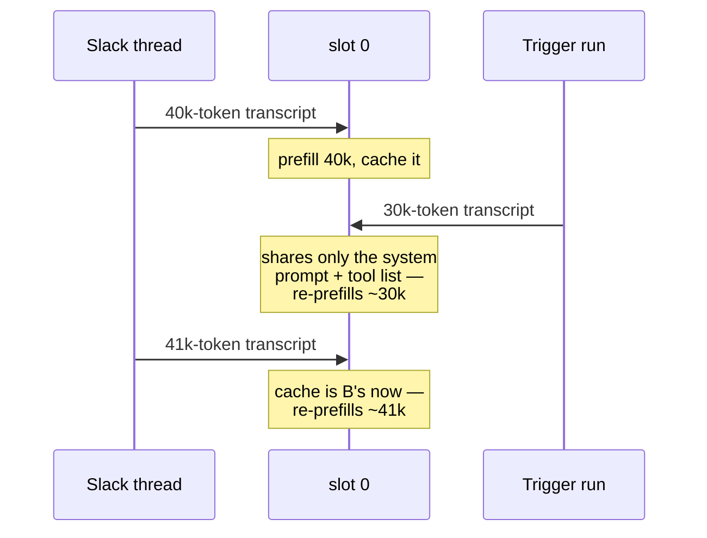

# Serving a local model

Everything on this page is about the process that holds the weights. How many
*agent* processes you run, and what each costs, is
[Interfaces](/docs/features/interfaces) — the answer there is that they are
ordinary HTTP clients and none of them holds a model.

The rest of this page is llama-server specific: slots, what `-c` really
divides, and the numbers that have to agree.

## Slots, and what `-np` really does

A local server does not hold "a context" — it holds *slots*, each with its own
KV cache, and the context you configured is **divided among them**:

```
llama-server -c 262144 -np 4     →   four slots of 65,536 tokens
llama-server -c 262144 -np 1     →   one slot of 262,144 tokens
```

This is the trap worth knowing before you meet it. Newer `llama-server` builds
default `-np` to more than one, so a server started with `-c 32768` and no
`-np` can hand each request 8,192 tokens while your `context_window` promises
32,768. Past that point the server **context-shifts instead of erroring**: the
model sees a mangled transcript, and the symptom is an empty completion that
looks like a model failure rather than a configuration one.

Check what you actually got rather than what you asked for:

```sh
curl -s localhost:8080/props | jq .total_slots
```

### The trade, measured

More slots buy throughput and cost a little latency. Measured on 2026-08-20 on
a quiet machine with a 35B MoE, 262,144 tokens per slot in every arm, 300
generated tokens (so this is generation rather than prefill), single-stream
median of 3:

| Configuration | Single stream | 4-stream throughput |
|---|---|---|
| `-c 262144 -np 1` | 88.6 tok/s | 85.7 tok/s |
| `-c 524288 -np 2` | 85.5 tok/s | 107.4 tok/s |
| `-c 1048576 -np 4` | 83–85 tok/s | 135–140 tok/s |

Four slots cost **about 5% of single-stream speed** — under a second on a
500-token answer — and return **about 1.6× throughput**, not 4×: generation is
bandwidth-bound, and speculative decoding is exactly the thing batching
dilutes. (An earlier measurement put the single-stream cost at 12%; it compared
arms at different `-c`, and was withdrawn.)

So the reference launch script runs **`-np 4`**, with `-c` raised to four
times the per-slot window, because `-c` is divided. The load-bearing reason is
not the throughput: [`mecha batch`](/docs/features/interfaces) and
[`mecha eval`](/docs/features/experiments/evaluation) default to
`--concurrency 4`, and against one slot that was worse than serial — four
conversations round-robining through a single KV cache, each evicting the
last one's prefix. At about 5%, interactive use pays almost nothing for the
extra slots.

## What happens when two agents talk to one slot

Nothing incorrect. Each request carries its whole transcript, the server
prefills it, and no state leaks between conversations. Requests beyond the
number of slots simply **queue** — a Slack message arriving while every slot is
busy waits its turn.

The cost is subtler and it is silent, and it appears once conversations
outnumber slots — at `-np 1`, as soon as there are two. A slot keeps the
previous prompt's tokens and reuses the longest common prefix with the next
one. Two conversations alternating on a single slot therefore look like this:



Each turn re-reads history the server had a moment ago. Nothing errors,
nothing is logged, and every answer is correct — it just gets slower in
proportion to how much context the two conversations hold. At a prefill rate
around 1,500 tok/s, a 50k-token transcript re-entering a slot someone else just
used is roughly 30 seconds of pure overhead before the first token.

:::tip[If you want real isolation, isolate the slot]
Raising `-np` gives concurrent conversations their own KV caches and stops the
thrash — at the cost of dividing `-c` and of the small single-stream slowdown
above. A host-memory prompt cache (`-cram`, sized above one slot's KV) lets a
slot pick an evicted prefix back up rather than re-prefilling it.

mecha also bounds the other side: background runs — delegated tasks and the
like, never your own chat turns — take a **permit** before holding the model, and by default
three may run at once against `-np 4`, one seat short of the server's so an
interactive turn never queues behind them. Interactive work takes no permit.
That is a latency control: beyond the slot count, throughput stops rising and
every turn just takes longer.
:::

## Unified memory has no separate pool

On DGX-class hardware — a GB10 and its relatives — there is no distinct VRAM to
budget against. `nvidia-smi` reports `N/A` for both total and used, because the
model's weights, the KV reservation, every agent process and the page cache all
come out of the same system memory.

Two consequences:

- **The KV cache is a startup reservation, not a growing cost.** A server
  started with a large `-c` takes its memory immediately and filling the
  context later moves nothing. `-c` costs memory, not speed; what costs speed is
  context actually *used*.
- **A server that loads while memory is contended stays slow for its whole
  life.** Whatever placement decision is made at load is never revisited — an
  instance started alongside another resident model has been measured holding
  ~10% below a fresh one and *not recovering* when the other stopped. So after
  restarting a model server, check tokens/sec rather than checking that the
  unit came back up. Liveness is precisely the check that cannot see this
  failure.

## Four numbers that have to agree

Keep the server launch flags and mecha configuration in sync:

| Number | Where | Rule |
|---|---|---|
| `-c` | the server's launch flags | The real window, divided by `-np`. |
| `context_window` | `[providers.X]` | Must equal `-c / -np`; confirm `n_ctx_slot` at startup or use `mecha setup` to probe it. |
| `--reasoning-budget` | the server's launch flags | Caps thinking so the model actually closes the block and answers. |
| `max_tokens` | `[agent]` | Must exceed the reasoning budget, comfortably — otherwise thinking consumes the whole allowance and the turn comes back empty, which mecha reports as an empty-output failure. |

`context_window` is the load-bearing one, because three separate behaviours
derive from it: the compaction threshold, the per-turn tool-output budget, and
the TUI's fuel gauge. Without it, overflow recovery — which keys on the
server's refusal, not the window — is the only thing that compacts. A stale value is worse than no value,
because everything downstream trusts it. See
[Context window and cost](/docs/features/models/providers#context-window-and-cost).

## Next

- [Providers](/docs/features/models/providers) — the trait, the backends, retries and
  fallbacks.
- [Compaction](/docs/features/models/compaction) — what happens as a transcript
  approaches the window.
- [Interfaces](/docs/features/interfaces) — which front-ends exist and which
  can steer a run.
