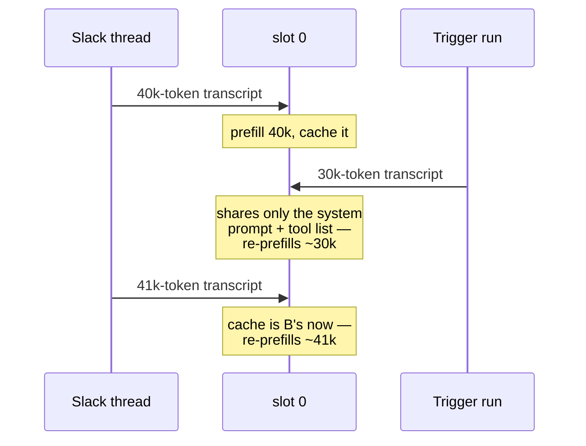

# Serving a local model

Everything on this page is about the process that holds the weights. How many
*agent* processes you run, and what each costs, is
[Interfaces](/docs/features/interfaces) — the answer there is that they are
ordinary HTTP clients and none of them holds a model.

The rest of this page is llama-server specific: slots, what `-c` really
divides, and the numbers that have to agree.

## Slots, and what `-np` really does

A local server does not hold "a context" — it holds *slots*, each with its own
KV cache, and the context you configured is **divided among them**:

```
llama-server -c 262144 -np 4     →   four slots of 65,536 tokens
llama-server -c 262144 -np 1     →   one slot of 262,144 tokens
```

This is the trap worth knowing before you meet it. Newer `llama-server` builds
default `-np` to more than one, so a server started with `-c 32768` and no
`-np` can hand each request 8,192 tokens while your `context_window` promises
32,768. Past that point the server **context-shifts instead of erroring**: the
model sees a mangled transcript, and the symptom is an empty completion that
looks like a model failure rather than a configuration one.

Check what you actually got rather than what you asked for:

```sh
curl -s localhost:8080/props | jq .total_slots
```

### The trade, measured

More slots buy throughput and cost latency. Measured on one machine with a
35B MoE at a short prompt and 300 generated tokens, so this is generation
rather than prefill:

| Configuration | Load | Throughput |
|---|---|---|
| `-c 131072 -np 1` | 1 stream | 79.8 tok/s |
| `-c 262144 -np 4` | 1 stream | 70.5 tok/s |
| `-c 262144 -np 4` | 4 streams | ~35 each, ~129 aggregate |

Four slots cost **12% of single-stream speed** and return **1.6× aggregate** —
so four independent tasks finish in about 0.6× the wall clock of running them
one after another, not 0.25×. Generation is bandwidth-bound, and speculative
decoding is exactly the thing batching dilutes.

The choice is therefore per workload, not global:

- **Interactive use** — chat, the TUI, Slack, a trigger — is single-stream.
  Keep `-np 1`.
- **A [batch](/docs/features/interfaces) or [eval](/docs/features/evaluation)
  sweep** genuinely fans out. Raise `-np`, and raise `-c` with it, because `-c`
  is divided.

## What happens when two agents talk to one slot

Nothing incorrect. Each request carries its whole transcript, the server
prefills it, and no state leaks between conversations. Concurrent requests
simply **queue** — a Slack message arriving mid-trigger waits its turn.

The cost is subtler and it is silent. A slot keeps the previous prompt's tokens
and reuses the longest common prefix with the next one. Two conversations
alternating on a single slot therefore look like this:



Each turn re-reads history the server had a moment ago. Nothing errors,
nothing is logged, and every answer is correct — it just gets slower in
proportion to how much context the two conversations hold. At a prefill rate
around 1,500 tok/s, a 50k-token transcript re-entering a slot someone else just
used is roughly 30 seconds of pure overhead before the first token.

:::tip[If you want real isolation, isolate the slot]
Raising `-np` gives concurrent conversations their own KV caches and stops the
thrash — at the cost of dividing `-c` and of the single-stream slowdown above.
The alternative, and usually the better one for a personal machine, is to
accept that interactive work is single-stream and let the queue do its job.
:::

## Unified memory has no separate pool

On DGX-class hardware — a GB10 and its relatives — there is no distinct VRAM to
budget against. `nvidia-smi` reports `N/A` for both total and used, because the
model's weights, the KV reservation, every agent process and the page cache all
come out of the same system memory.

Two consequences:

- **The KV cache is a startup reservation, not a growing cost.** A server
  started with a large `-c` takes its memory immediately and filling the
  context later moves nothing. `-c` costs memory, not speed; what costs speed is
  context actually *used*.
- **A server that loads while memory is contended stays slow for its whole
  life.** Whatever placement decision is made at load is never revisited — an
  instance started alongside another resident model has been measured holding
  ~10% below a fresh one and *not recovering* when the other stopped. So after
  restarting a model server, check tokens/sec rather than checking that the
  unit came back up. Liveness is precisely the check that cannot see this
  failure.

## Four numbers that have to agree

Nothing enforces these, and a mismatch in any of them is silent:

| Number | Where | Rule |
|---|---|---|
| `-c` | the server's launch flags | The real window, divided by `-np`. |
| `context_window` | `[providers.X]` | Must equal `-c`. Nothing can discover it — a provider reports what a prompt *cost*, never what is left. |
| `--reasoning-budget` | the server's launch flags | Caps thinking so the model actually closes the block and answers. |
| `max_tokens` | `[agent]` | Must exceed the reasoning budget, comfortably — otherwise thinking consumes the whole allowance and the turn comes back empty, which ends a run silently. |

`context_window` is the load-bearing one, because four separate behaviours
derive from it: the compaction threshold, the per-turn tool-output budget, the
TUI's fuel gauge, and overflow recovery. A stale value is worse than no value,
because everything downstream trusts it. See
[Context window and cost](/docs/features/providers#context-window-and-cost).

## Next

- [Providers](/docs/features/providers) — the trait, the backends, retries and
  fallbacks.
- [Compaction](/docs/features/compaction) — what happens as a transcript
  approaches the window.
- [Interfaces](/docs/features/interfaces) — which front-ends exist and which
  can steer a run.
